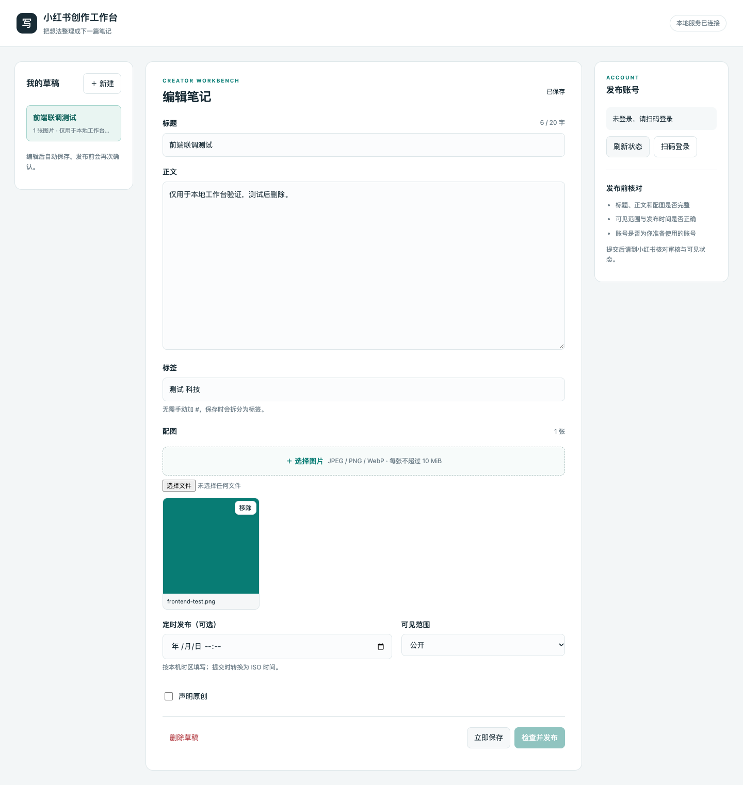

# XHS Studio

XHS Studio 是基于 [xpzouying/xiaohongshu-mcp](https://github.com/xpzouying/xiaohongshu-mcp) 的衍生项目，由 Ao Li 增加本地 Python 桥接和网页工作台。上游提供小红书登录、浏览器自动化及 MCP 能力；本项目增加草稿编辑、图片上传、预览校验和手动确认提交流程。

上游 Go 源码和 Apache-2.0 [LICENSE](LICENSE) 保留在仓库中。原 README 原文保存在 [README_UPSTREAM.md](README_UPSTREAM.md)，其中的作者经历、捐赠信息和演示属于上游作者。新增工作台见 [workbench/README.md](workbench/README.md)，归属说明见 [NOTICE](NOTICE)。本项目与小红书官方没有隶属关系，发布通过上游浏览器自动化完成。



## 本地启动

需要 Python 3.11+。使用工作台无需 Node.js 或 Go 构建环境；首次运行需要网络下载上游程序和浏览器。

```bash
python3 workbench/run.py
```

启动器从上游官方 GitHub Releases 下载固定 **v2.5.5** 二进制并校验 SHA256，随后启动独立服务：

- 工作台：<http://127.0.0.1:18088>
- 上游后端：`http://127.0.0.1:18061`

启动器管理的服务仅绑定 loopback；工作台和后端使用独立端口。安装包支持 macOS Apple Silicon、Linux x64、Windows x64；完整本地流程目前实测平台为 macOS。

```bash
# 只下载并验证依赖，不启动服务
python3 workbench/run.py --install-only

# 自定义端口，不自动打开浏览器
python3 workbench/run.py --ui-port 18088 --backend-port 18061 --no-open

# 连接已有的本地后端；令牌文件使用绝对路径
python3 workbench/run.py --connect-existing http://127.0.0.1:18061 --backend-token-file /absolute/path/to/token
```

## 使用流程

1. 新建草稿，填写标题、正文和标签，上传本地图片。
2. 获取登录二维码，使用小红书 App 扫码，再检查登录状态并核对账号。
3. 点击“检查并发布”，校验内容、素材和定时时间，打开发布前预览。
4. 核对内容，手动确认提交。

提交记录保存在本机。同一快照已经提交或结果未知时，换预览凭据、重启工作台都不会直接再次提交。结果未知时，先到小红书核对，只有确认没有发布后才能手动解除锁定。

工作台目前支持图文，视频仍可通过上游 MCP 使用。草稿保存在本机，不会自动提交。直接静态托管 `workbench/web` 可以演示草稿、编辑和预览；真实登录、上传及发布需要本地 Python 桥接与后端。

## 数据与验证边界

令牌、cookies、上传图片和草稿位于 `workbench/.runtime/`，属于本机运行数据，不应提交 Git。分享项目时只分享源码；重新下载代码时不要覆盖已有运行数据。

真实发帖尚未测试，需用户扫码并提供具体发布内容后验证。后端提交成功不等于笔记已通过审核或对外可见，最终结果应回到小红书检查。

工作台 CI 运行 Python 单元测试和 JavaScript 语法检查，不登录或发布笔记。另有独立的 GitHub Pages 流程，只部署静态网页文件，不包含本机运行数据或发布服务：

```bash
python3 -m unittest discover -s workbench/tests
node --check workbench/web/app.js
```

本地实测与范围见 [验证记录](workbench/VALIDATION.md)。Go 源码沿用上游，本次没有改动；上游工作流保留在仓库中。

## 许可与来源

项目按 Apache-2.0 分发，保留上游版权和许可声明，新增代码归属见 [NOTICE](NOTICE)。上游 HTTP/MCP API 和部署资料可查阅 [上游 README](README_UPSTREAM.md) 及 [docs/API.md](docs/API.md)。
